<!-- Violet Signal / Design 29. Profile: Abhilasha-Ahingare. Edit scripts/build_theme.py to regenerate this file. -->

<picture>
  <source media="(max-width: 600px)" srcset="./assets/hero-mobile.svg">
  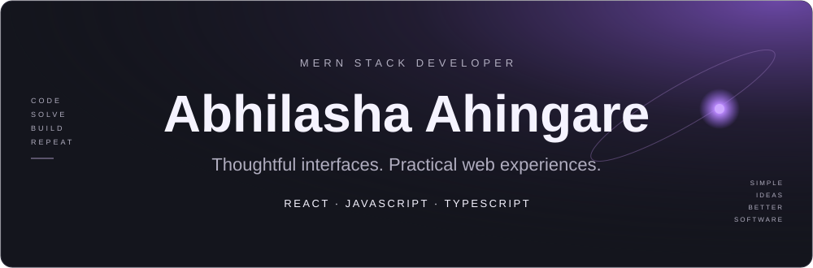
</picture>

<picture>
  <source media="(max-width: 600px)" srcset="./assets/core-stack-mobile.svg">
  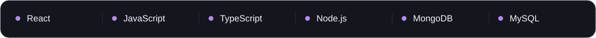
</picture>

  <a href="mailto:abhilashaahingare.02@gmail.com">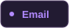</a>
  

<picture>
  <source media="(max-width: 600px)" srcset="./assets/section-projects-mobile.svg">
  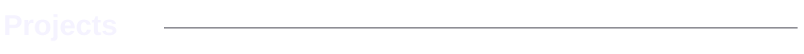
</picture>

<picture>
  <source media="(max-width: 600px)" srcset="./assets/projects-mobile.svg">
  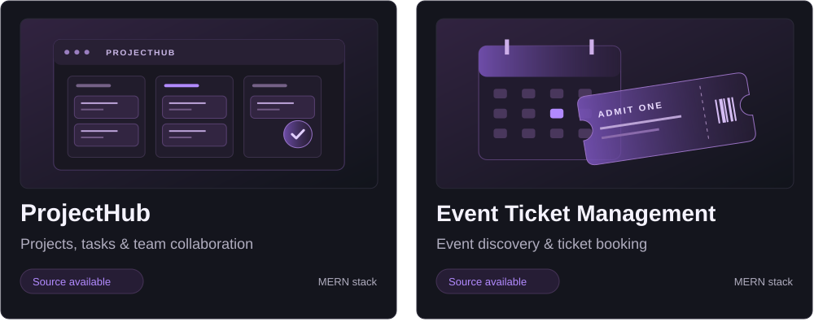
</picture>

  <a href="https://github.com/Abhilasha-Ahingare/project-management-system">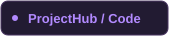</a>
  

More projects &amp; learning repositories

- [Event Management & Ticketing System](https://github.com/Abhilasha-Ahingare/Event-Management-Ticketing-System)
- [React Projects](https://github.com/Abhilasha-Ahingare/REACT-PROJECT)
- [MERN Stack Projects](https://github.com/Abhilasha-Ahingare/MERN-STACK-PROJECTS)
- [HTML, CSS & JavaScript Projects](https://github.com/Abhilasha-Ahingare/HTML_CSS_JAVASCRIPT_PROJECTS)
- [HTML & CSS Projects](https://github.com/Abhilasha-Ahingare/HTML-CSS-PROJECTS)
- [JavaScript Mini Projects](https://github.com/Abhilasha-Ahingare/JAVASCRIPT-MINI-FUNCTIONALITY-PROJECT-S)

<picture>
  <source media="(max-width: 600px)" srcset="./assets/about-mobile.svg">
  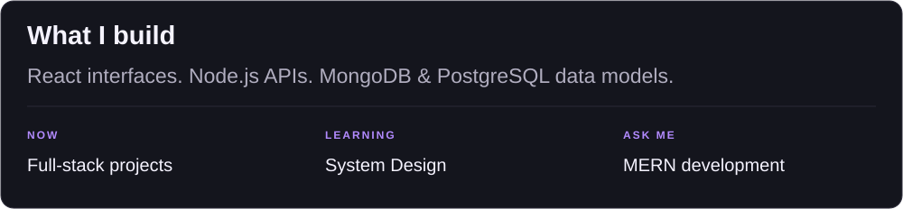
</picture>

<picture>
  <source media="(max-width: 600px)" srcset="./assets/section-stack-mobile.svg">
  
</picture>

**Languages**

  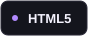
  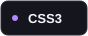
  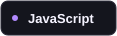
  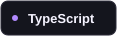

**Frontend & styling**

  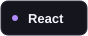
  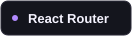
  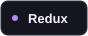
  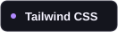
  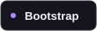
  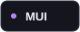
  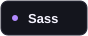
  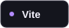

**Backend & data**

  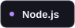
  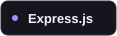
  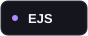
  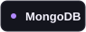
  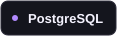

**Tools & design**

  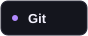
  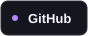
  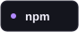
  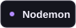

**Currently learning**

<picture>
  <source media="(max-width: 600px)" srcset="./assets/section-activity-mobile.svg">
  
</picture>

<picture>
  <source media="(max-width: 600px)" srcset="./assets/metrics/overview-mobile.svg">
  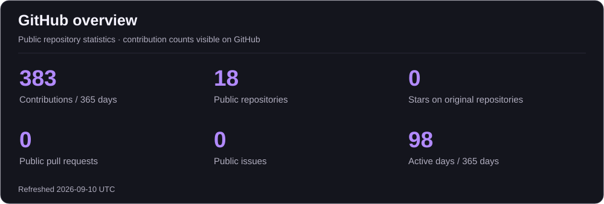
</picture>

<picture>
  <source media="(max-width: 600px)" srcset="./assets/metrics/streak-mobile.svg">
  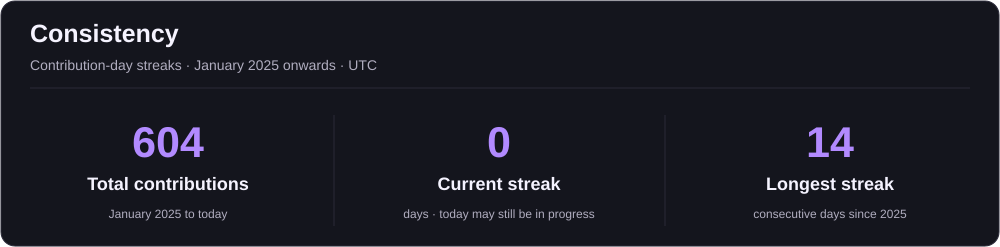
</picture>

<picture>
  <source media="(max-width: 600px)" srcset="./assets/metrics/languages-mobile.svg">
  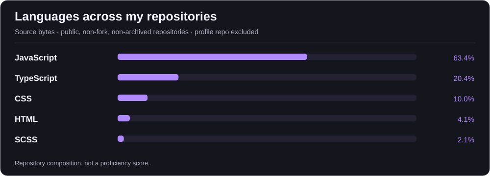
</picture>

<picture>
  <source media="(max-width: 600px)" srcset="./assets/metrics/calendar-mobile.svg">
  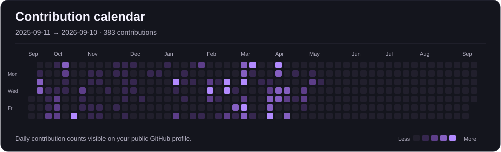
</picture>

<picture>
  <source media="(max-width: 600px)" srcset="./assets/metrics/top-repos-mobile.svg">
  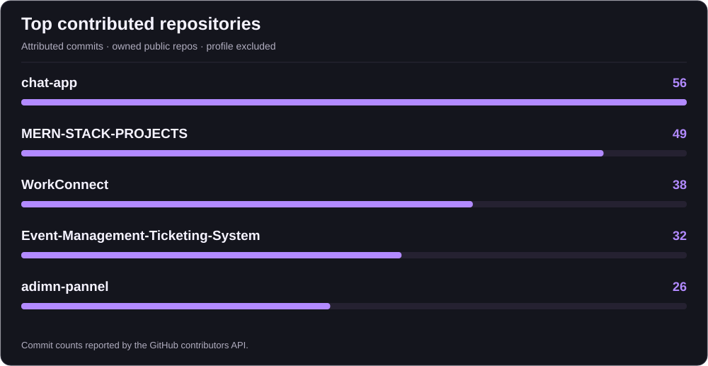
</picture>

Activity details &amp; repository links

- [Daily contribution table and repository ranking](./data/ACTIVITY.md)
- [Complete metrics snapshot](./data/metrics.json)

Cards refresh through the included GitHub Actions workflow. The contribution calendar covers the latest 365 days; streaks use the available history from the account-creation year. Language percentages describe repository code, not proficiency. The repository ranking includes owned public repositories and uses GitHub-attributed commit counts.

<picture>
  <source media="(max-width: 600px)" srcset="./assets/metrics/quote-mobile.svg">
  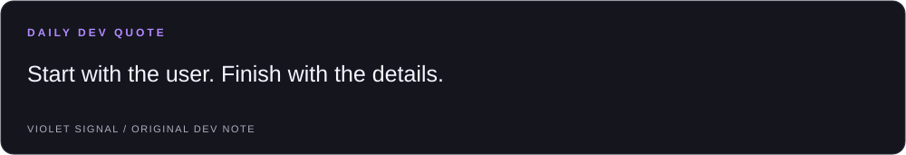
</picture>

<a href="mailto:abhilashaahingare.02@gmail.com">
<picture>
  <source media="(max-width: 600px)" srcset="./assets/footer-mobile.svg">
  
</picture>
</a>

  

